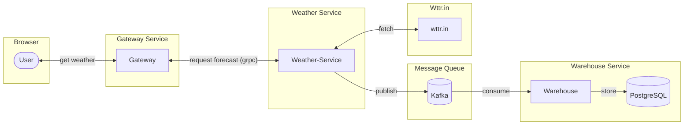
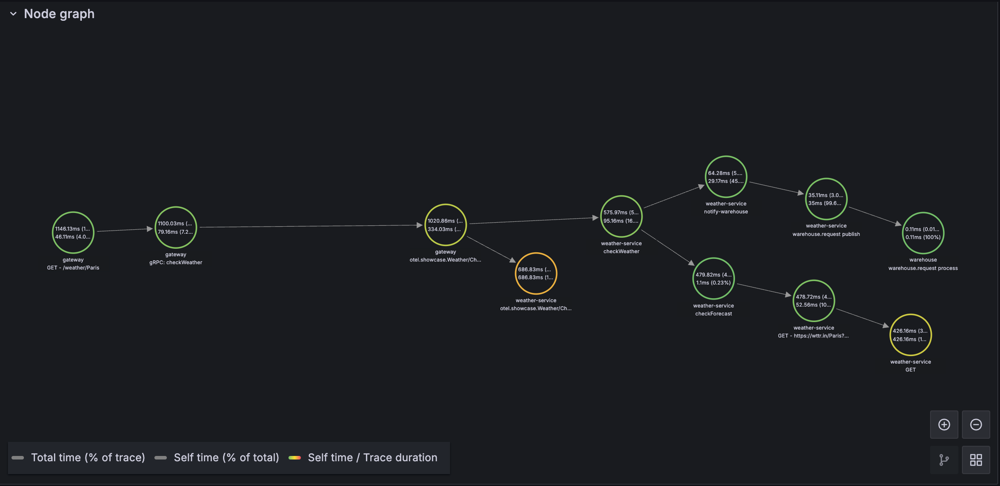
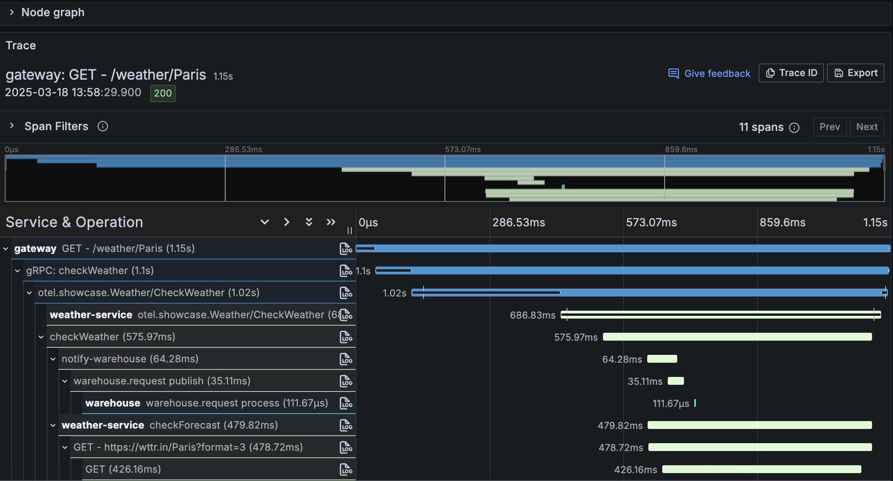
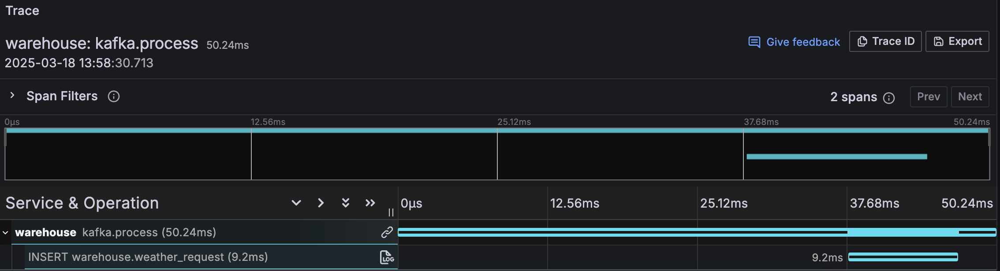

# otel4s-showcase 

> [!WARNING]
> The project relies on the **experimental** 
> [otel4s-opentelemetry-java](https://github.com/iRevive/otel4s-opentelemetry-java) distribution of the 
> [OpenTelemetry Java Agent](https://opentelemetry.io/docs/zero-code/java/agent/).

The project utilizes [otel4s](https://typelevel.org/otel4s/) and customized [OpenTelemetry Java Agent](https://opentelemetry.io/docs/zero-code/java/agent/) 
to implement end-to-end tracing.

[Grafana OTeL LGTM](https://github.com/grafana/docker-otel-lgtm) collects metrics and traces. 

## Project architecture

The project has three services:
- `gateway` - user-facing interface, the gateway communicates with `weather-service` via gRPC
- `weather-service` - the service returns the weather forecast, submits request detail to the Kafka 
- `warehouse` - consumes messages from the Kafka and stores request details in the PostgreSQL



## Docker environment

> [!WARNING]
> Make sure the [create-database.sh](docker/pg/initdb/create-database.sh) is executable, otherwise the PostgreSQL container will fail to start.
> ```shell
> $ chmod +x ./docker/pg/initdb/create-database.sh
> ```

Run the following command to spin the dockerized environment:
```shell
$ docker compose -f docker/docker-compose.yml up -d
```

## Running the services

The service can be started via sbt:
```shell
$ sbt gateway/run
$ sbt warehouse/run
$ sbt weather-service/run
```

## Requesting the weather

```shell
$ curl localhost:9000/weather/Paris
```

## Generated traces 

> [!NOTE]
> Since the service uses OTeL Agent, many components are instrumented automatically,
> such as `Java HTTP client`, `JDBC`, `Kafka`, and so on.

All services are linked together:


And the spans are correlated too: 


Warehouse consumer has its own independent span:


## Correlated logs

OTeL Agent configures Logback MDC automatically. All you need to do is configure the `logback.xml`:
```xml
<encoder>
    <pattern>%date [%thread] %level %logger{36} - trace_id=%X{trace_id} span_id=%X{span_id} - %message%n%xException</pattern>
</encoder>
```

The MDC works fine with pure Logback and log4cats wrappers too.

Gateway service:
```
2025-03-18 13:58:29,943 [io-compute-6] INFO otel.showcase.gateway.Server - trace_id=8a5e651655e9adabd4972d3f5a60c52c span_id=7a51a15fb085736e - Request: WeatherRequest(Paris,127.0.0.1,UnknownFieldSet(Map()))
```

Weather service:
```
2025-03-18 13:58:30,454 [io-compute-3] INFO o.showcase.weather.WeatherService - trace_id=8a5e651655e9adabd4972d3f5a60c52c span_id=3d140137b33630f4 - Checking forecast for Paris
```